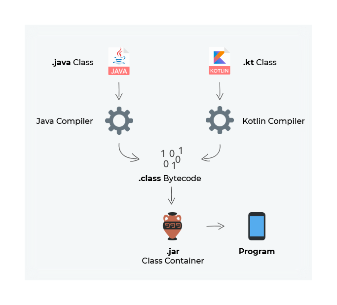
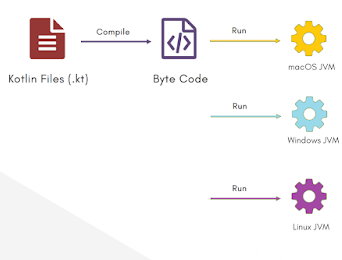
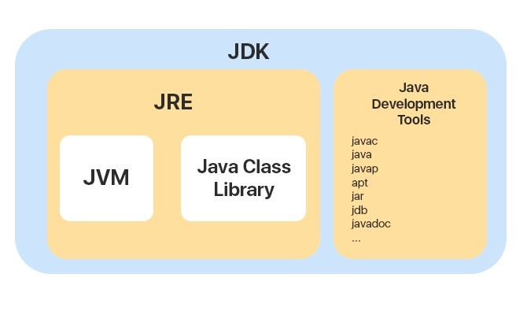

# Kotlin Tutorial 👨🏻‍💻


# What is Kotlin ❓

- Kotlin is a new programming language, developed by JetBrains. Jetbrains is a popular software development company which has developed various popular software like Android Studio, IntelliJ Idea, Pycharm, etc.
- Kotlin started out as a modern replacement of Java, which was created during 1990s and a lot of the learnings has been incorporated since then and lot of features and additional functionality which Java lacked was added to kotlin.
- Kotlin is a general-purpose programming language that can be used -
  - To target JVM (Kotlin's code can be compiled to Java ByteCode - which can run on any JVM where Java runs)
  - Android Apps (Android is now Kotlin First)
  - Native Apps like macOS or Linux Apps can be created using Kotlin 
  - JavaScript - You can transpile Kotlin code to JavaScript as well
- Overall Kotlin is a powerful language that can be used to target multiple platforms and multiple environments.

## History Of Kotlin 🌏
- In 2011, Jetbrains announced the development of Kotlin.
- It was made open source in 2012, so that other developers can contribute. It is the language for the developers, by the developers.
- Kotlin 1.0 - was made live in 2016. (Signifying that it has gone through a lot of changes in that process)
- After Google IO 2017, Kotlin started trending in the developer community. Most people from the Android community rapidly shifted towards Kotlin as Android provided first-class support for Kotlin.
- 2019, Android became Kotlin First i.e. Primary Language to develop Android apps.

## Features of Kotlin 📌
- **Statically Typed Language and Completely Interoperable with JAVA** - Kotlin is a statically typed programming language that runs on JVM and is completely interoperable with the Java programming language. You can use Kotlin along with the Java programming language in your applications without needing to migrate all your code to Kotlin.
- **Object-Oriented Language** - Kotlin is Object-Oriented Language - you can write classes, have objects. The Four key concepts of Object-Oriented Programming - Abstraction, Inheritance, Encapsulation, and Polymorphism are fully supported in Kotlin. Some of the implementation details of these features have improved from the Java world.
- **Functional Language** -  Kotlin is a functional language. Concepts like Lambda functions, Higher-Order Function, First-class functions are supported in Kotlin as well.
- **Safe Language, Concise, Powerful**
  - **Safe** - Kotlin improves the quality of your released apps through “safety” features that have been designed to reduce the number of bugs and system failures. For example, it has a strong type system based on null safety. This means by default, variables can’t be null, so you can catch more errors at compile time before shipping to users. This is useful. Null references were famously called a “billion-dollar mistake” by their inventor, Tony Hoare.
  - **Concise and Powerful** - Less code combined with greater readability. Kotlin keeps things brief by adding powerful, concise abstractions that don’t affect the readability of the code you create. Less verbose and more powerful.
  - **Open Source** - You can look into the source code of the language and appreciate the beauty of this powerful programming language. You can contribute to this project which can be found at this [URL](https://github.com/JetBrains/kotlin)

## Kotlin Development Environment Setup 🔧
- There are two methods to run kotlin:
  1. Install - **[Java(JDK 8)](https://www.oracle.com/java/technologies/downloads/)** & **[Intelli J Idea](https://www.jetbrains.com/idea/download)**.
  2. You can run your Kotlin code directly from the browser itself, using **[Kotlin playground]( https://play.kotlinlang.org/)**.

## Questions 📍
###### Q: Since we are working with Kotlin. Why do we need Java JDK?
- Kotlin is a JVM Language. Kotlin code compiles down to bytecode which then runs on JVM. So we need JVM. Along with that, we need few Java Libraries which are present in JDK to run the Kotlin program.

###### Q: JDK vs JVM? 
- JVM is a Java Virtual Machine. Once you compile your Kotlin code, it gets converted to .class files i.e. bytecode. This bytecode runs on JVM. Due to this mechanism of generating bytecode, Kotlin and Java code can run on different environments. We just need a JVM for that particular environment. For instance,


> JDK is JVM + other libraries + some development tools



##  Inspiration for the project 👼
- ### [Halil Özel](https://github.com/halilozel1903/KotlinTutorials) 💜

## The goal of the project 🎯
Starting from the most basic topics about Kotlin, to learning advanced topics and creating an interactive project by sharing the information I have learned with you.

## Project Content 🛠
It is a project that contains various information and examples about the basics of programming with Kotlin. <br>

## Project Subjects 🔖
- Overview
- Basics
- Control Flow
- Array & String
- Functions
- Collections
- OOPs Concept
- Exception Handling
- Null Safety
- Regex & Ranges
- Java Interoperability
- Miscellaneous
## Resources  📚

1. https://kotlinlang.org/docs/kotlin-docs.pdf
2. https://www.cheezycode.com/
3. https://play.kotlinlang.org/byExample/overview


## License  ℹ️
```
MIT License

Copyright (c) 2022 Mustajab Ikram

Permission is hereby granted, free of charge, to any person obtaining a copy
of this software and associated documentation files (the "Software"), to deal
in the Software without restriction, including without limitation the rights
to use, copy, modify, merge, publish, distribute, sublicense, and/or sell
copies of the Software, and to permit persons to whom the Software is
furnished to do so, subject to the following conditions:

The above copyright notice and this permission notice shall be included in all
copies or substantial portions of the Software.

THE SOFTWARE IS PROVIDED "AS IS", WITHOUT WARRANTY OF ANY KIND, EXPRESS OR
IMPLIED, INCLUDING BUT NOT LIMITED TO THE WARRANTIES OF MERCHANTABILITY,
FITNESS FOR A PARTICULAR PURPOSE AND NONINFRINGEMENT. IN NO EVENT SHALL THE
AUTHORS OR COPYRIGHT HOLDERS BE LIABLE FOR ANY CLAIM, DAMAGES OR OTHER
LIABILITY, WHETHER IN AN ACTION OF CONTRACT, TORT OR OTHERWISE, ARISING FROM,
OUT OF OR IN CONNECTION WITH THE SOFTWARE OR THE USE OR OTHER DEALINGS IN THE
SOFTWARE.
```


